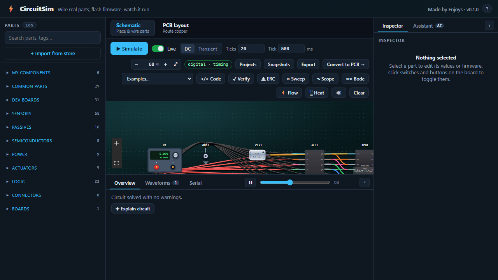
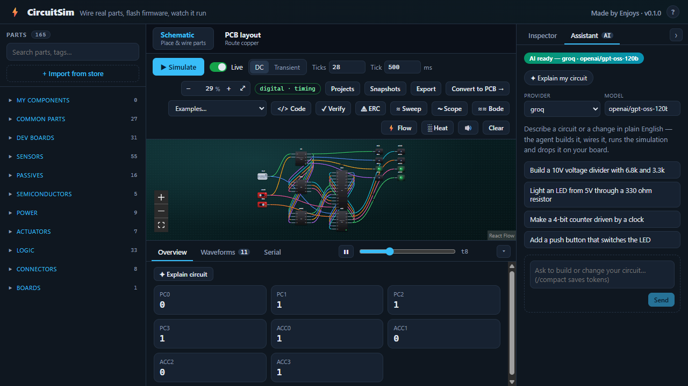
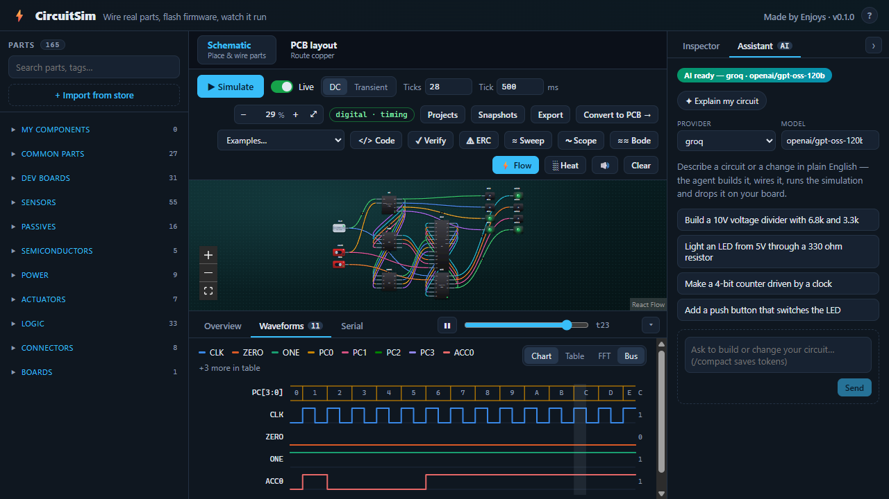
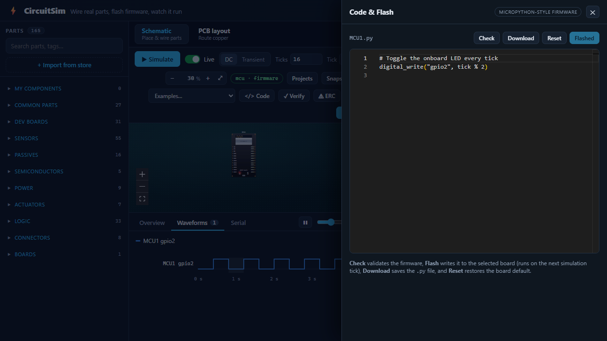
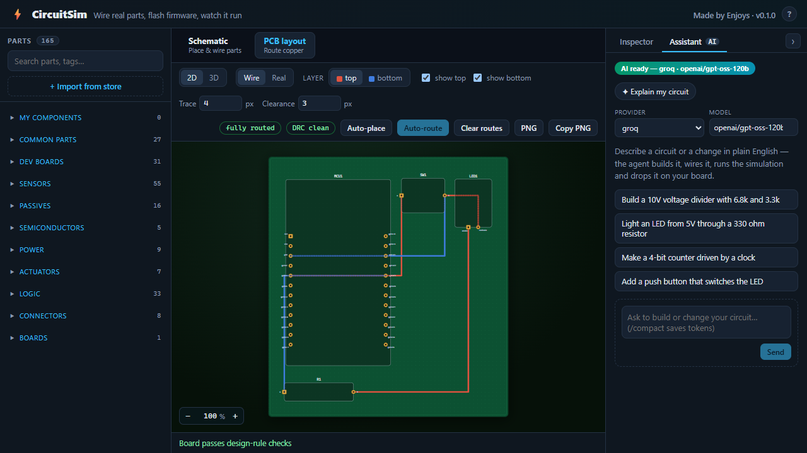

# CircuitSim

> [!NOTE]
> This project is inspired by [**eSim**](https://github.com/fossee/esim) (a downloadable
> desktop EDA tool) — **thanks to the [FOSSEE Team](https://www.fossee.in/) at
> [IIT Bombay](https://www.iitb.ac.in/)**. Unlike eSim, **CircuitSim is browser-based**:
> no install, it runs entirely in your browser.

An open-source, browser-based electronics playground: draw a **schematic**, watch it
**simulate** (analog, digital, and MCU firmware), then flip to a **PCB editor** with a
real **three.js 3D** view — all in one app.

> [!NOTE]
> Monorepo: a **FastAPI** backend (simulation engines + catalog + realtime) and a
> **React + Vite + TypeScript** frontend (schematic canvas, PCB editor, 3D).

---

## Screenshots

| Workspace | Digital ALU | Waveforms |
|-----------|-------------|-----------|
|  |  |  |

| ESP32 firmware | PCB editor |
|----------------|------------|
|  |  |

---

## Features

### Schematic & simulation
- Drag parts from a 160+ component library, wire pins, and simulate live.
- **Three engines**, auto-selected per circuit:
  - **Analog** — modified nodal analysis with Newton iteration (diodes, LEDs, BJTs,
    MOSFETs, regulators) and backward-Euler transients for RC/RL curves.
  - **Digital** — gates, clocks, mux, flip-flops, counters, registers and ALUs with
    fix-point settling and per-tick timing waveforms.
  - **MCU** — runs board firmware tick-by-tick in a sandboxed Python subset against the
    analog network (ESP32 blink / thermostat / button / OLED / servo examples).
- **Code & Flash editor** — write MCU firmware in a built-in Monaco editor with one-click
  **Check** (server-side validation), **Flash**, **Download .py**, and **Reset to default**.
- Live results: node values, waveforms, serial console, and playback scrubbing.
- **Schematic undo/redo** (`Ctrl+Z` / `Ctrl+Y`), **net labels** (name a net; same-named
  labels join without drawing a wire), and **snapshots** (local version history).
- **Current-flow animation** and a **node-voltage heatmap** painted on the wires from the
  live simulation; inspector **resistor colour-code** & **LED series-resistor** calculators.
- Ready-made examples across analog, power, digital, **computer (ALU + CPUs)**, and MCU.

### Analysis & verification
- **AC analysis / Bode plot** — frequency response (gain dB + phase) from a complex-MNA engine.
- **FFT spectrum** of analog waveforms and a **logic-analyzer** timing view with **hex bus lanes**.
- **Serial plotter** — graph numeric `print()` output over time, beside the text monitor.
- **Electrical Rule Check (ERC)** — floating pins, missing ground, and conflicting drivers.
- **Verify** (truth-table / test vectors), **parameter sweep**, and an **oscilloscope** capture.

### Custom & flexible parts
- Build your own component (name, pins, values) that can **behave like** a base part
  (resistor, capacitor, LED, source, diode, inductor, potentiometer, push button) so it
  simulates electrically while keeping its own name and artwork.
- Save presets ("My Parts") and reuse "Common parts".

### Real parts & vendor catalog
- 40+ **parametric sensor types** (ultrasonic, IMU, gas, PIR, pressure, flow, load cell,
  …) with editable readings and a **“View on robu.in”** buy link in the inspector.
- **Import from store** — browse/search **thousands of real [robu.in](https://robu.in)
  parts** by category and import any one **on demand**; it drops straight into the palette
  ready to place, linked back to its product page.

### PCB editor
- **Convert to PCB** places every schematic part on the board, or drop parts directly
  onto the PCB to start from scratch — both views stay in sync.
- Move / **rotate / flip** footprints with on-canvas handles; traces follow dragged and
  rotated parts (no stale copper).
- **Right-sidebar inspector** (mm units): board size, per-part rotation, pad width/height
  and rotation, and a **resizable body outline**.
- Copper routing with vias, **layer-aware connectivity** (cross-layer only through a pad
  or via) and **DRC** including clearance and **short** (crossing-trace) detection.
- **Auto-route** every connection, then **reshape traces by hand** — drag a route to bend
  it, double-click to add a joint, right-click a joint to remove.
- **Undo / redo** the whole layout with `Ctrl+Z` / `Ctrl+Y`.
- **Export the board as a PNG** (download or copy to clipboard); copper running under a
  component shows through as a faded dotted ghost.
- **Wire / Real** render modes (pads & traces vs. real component artwork).
- **Connectors**: male/female headers and USB-A / USB-B / USB-C.
- **Switches**: SPDT, slide, and 4-way DIP.
- **Design-rule editor** — configurable DRC clearance; **interactive BOM** (click a part to
  highlight its footprint on the board).
- **Manufacturing export** — **Gerber** (RS-274X) + **Excellon** drill, zipped, plus a
  **pick-and-place / centroid CSV** for assembly houses.

### 3D board view
- A real **three.js** scene (board, copper pads, traces, extruded component bodies with
  per-family heights and labels). Drag to orbit, scroll to zoom, right-drag to pan.

### AI assistant (optional)
- Describe a circuit in plain English and the assistant builds it, wires it, runs the
  simulation and drops it on your board. Grounded in the real component catalog.
- **Multi-provider**: Groq, Gemini, Mistral, OpenRouter, NVIDIA, OpenAI or Anthropic —
  add any one key (e.g. `GROQ_API_KEY`) and switch the **provider & model per request**
  right from the panel. Stays gracefully disabled until a key is configured.

### Projects & export
- Save / load projects plus **local snapshots** (version history).
- Export **BOM (CSV)**, **netlist**, **circuit JSON**, **SPICE `.cir` (import & export)**,
  **Gerber + drill (.zip)**, **pick-and-place (.csv)**, schematic **SVG / PNG**, and **Print / PDF**.

---

## Tech stack

| Layer     | Stack |
|-----------|-------|
| Frontend  | React 18, TypeScript 5, Vite 5, @xyflow/react, three.js + @react-three/fiber/drei, Monaco |
| Backend   | Python 3.13, FastAPI, SQLAlchemy, Pydantic |
| Storage   | PostgreSQL (durable) + SQLite (realtime buffer) |

---

## Repository layout

```
.
├── frontend/   # React/Vite app — schematic, PCB editor, 3D, inspector
│   └── src/features/{board,pcb,parts,simulation,catalog,examples,...}
├── backend/    # FastAPI — engines, catalog, realtime, API  (see backend/README.md)
│   └── app/{api,services,engines,domain,repositories,realtime,seed}
└── README.md
```

---

## Quick start

**Prerequisites:** Node 18+, Python 3.13, and PostgreSQL (Docker is easiest).

### 1. Database (Docker)

```bash
docker run -d --name postgres18 -e POSTGRES_PASSWORD=postgres \
  -e POSTGRES_DB=circuitsim -p 5432:5432 postgres:18
```

### 2. Backend

```bash
cd backend
python -m venv .venv
.venv\Scripts\activate            # Windows (use source .venv/bin/activate on *nix)
pip install -e ".[dev]"
copy .env.example .env             # then set POSTGRES_DSN
python -m uvicorn app.main:app --port 8000
```

The API serves under `http://localhost:8000/v1/api` and seeds the component catalog on
startup. See [backend/README.md](backend/README.md) for engine internals and config.

### 3. Frontend

```bash
cd frontend
npm install
npm run dev                        # http://localhost:5173  (proxies /v1/api -> :8000)
```

Open http://localhost:5173, drop in parts (or load an example), and press **Simulate**.

---

## Development

```bash
# Frontend
npm run typecheck      # tsc --noEmit
npm run build          # production build into dist/

# Backend
.venv/Scripts/python.exe -m ruff check app     # lint
```

The backend can serve the built frontend from `dist/` at `/` for a single-origin deploy.

---

## Project status

Actively developed. Simulation (analog/digital/MCU), the firmware **Code & Flash** editor,
the PCB editor (routing, DRC, hand-editable traces, undo/redo, PNG export, 3D), the
multi-provider AI assistant, and **on-demand part import** from robu.in are working end to
end. See the in-app examples for a tour across every engine.
